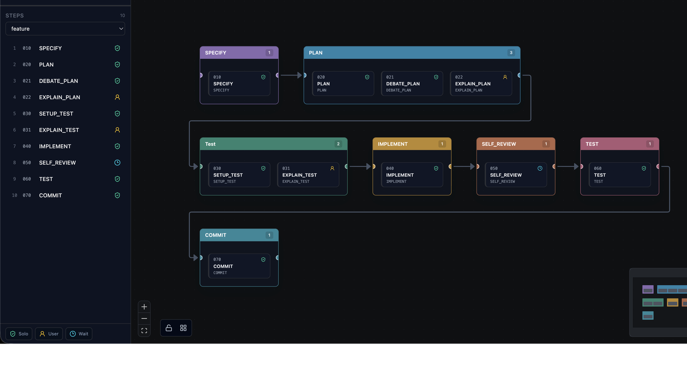
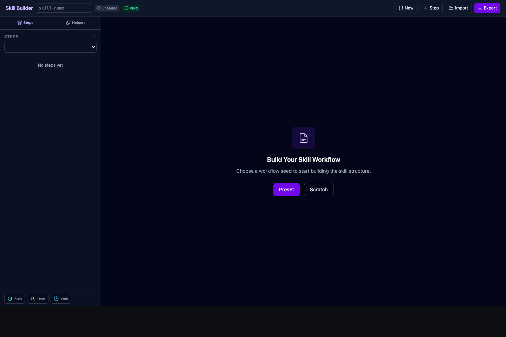

<h1 align="center">Skill Builder</h1>

<p align="center">
  A Claude Code/Codex skill that opens a local visual editor for turning repeatable agent work into documented, stateful automation workflows.
</p>

<p align="center">
  <a href="https://github.com/sangmandu/skill-builder/actions/workflows/plugin-ci.yml"></a>
  <a href="./LICENSE"></a>
  
  
</p>

<p align="center">
  
</p>

## Why

Most useful agent workflows start as loose chat habits: clarify the task, write a plan, run a review, test, summarize, commit. Skill Builder turns those repeated habits into a real skill package with step files, helpers, tracks, runtime state, scripts, and export metadata for Claude Code or Codex.

Skill Builder is not a standalone platform, SaaS product, or separately hosted app. The user installs a plugin and runs a skill. That skill contains the launcher and UI files, so the agent harness reads the `skill-builder` skill, runs its bundled launcher, and opens the local editor from inside the skill package.

## Install

### Claude Code

Claude Code uses a two-step marketplace flow: add the marketplace, then install the plugin from it.

From your terminal:

```bash
claude plugin marketplace add sangmandu/skill-builder
claude plugin install skill-builder@sangmandu
```

Inside Claude Code, the equivalent slash commands are:

```text
/plugin marketplace add sangmandu/skill-builder
/plugin install skill-builder@sangmandu
```

If Claude Code is already running, reload plugins before invoking the skill:

```text
/reload-plugins
/skill-builder:skill-builder
```

### Codex

```bash
codex plugin marketplace add https://github.com/sangmandu/skill-builder
```

Then ask Codex to run Skill Builder for the current project or skill package.

## First Run

When there is no existing skill package, the Skill Builder skill inspects the current project before asking broad questions. It runs the bundled discovery helper, summarizes what it found, and proposes a starter workflow from project evidence such as package scripts, source folders, tests, docs, and CI files.

The first-run authoring session does not start a generated workflow runtime:

- No generated `run.sh init`
- No `.workflow/state.json`
- No generated hook invocation
- No stop guard or user prompt hook for Skill Builder itself

The first draft can be created visually from a preset or conversationally by asking the agent to add, remove, reorder, or rewrite steps.

<p align="center">
  
</p>

## What It Builds

- Thin `SKILL.md` entrypoints for lazy loading
- Step files such as `010-specify.md`, `020-plan.md`, and `040-implement.md`
- `helpers.yaml` for reusable common skill instructions
- `track-steps.json` for feature/light/custom workflow paths
- `state-schema.json` and `.workflow/state.json` runtime state
- `run.sh` plus generated runtime scripts for init, complete, resume, rewind, and interrupt
- Target-specific metadata for Claude Code or Codex

## How It Works

Skill Builder is itself a skill. The editor files live inside the skill folder:

```text
plugin-src/skills/skill-builder/
  SKILL.md
  scripts/open-builder.sh
  scripts/discover-workflow.sh
  app/
```

The committed plugin bundles keep installation direct:

```text
claude-plugin/                         # Claude Code plugin bundle
plugins/skill-builder/                 # Codex plugin bundle
.claude-plugin/                        # Claude marketplace metadata
.agents/plugins/                       # Codex marketplace metadata
```

`plugin-src/skills/skill-builder/` is the source of truth. `npm run sync:plugins` copies that skill, including its bundled editor files, into both runtime-specific plugin bundles.

<details>
<summary>Maintainer Notes</summary>

### Validation

```bash
npm run lint
npm run build
npm run test:scenarios
npm run test:e2e:clean-cli
npm run sync:plugins
npm run validate:plugins
```

`test:e2e:clean-cli` runs in Docker with a clean HOME, installs Claude Code and Codex CLIs, adds this repo as a local marketplace, installs the Skill Builder plugin, launches the bundled editor, imports a sample project, exports a generated skill, starts that generated skill runtime, and verifies hook ownership isolation.

Optional Codex marketplace validation:

```bash
SKILL_BUILDER_VALIDATE_CODEX_MARKETPLACE=1 npm run validate:plugins
```

### Design

See [DESIGN.md](./plugin-src/skills/skill-builder/app/DESIGN.md) for visual design tokens and UI rules.

</details>

## References

- Claude Code plugin docs: https://code.claude.com/docs/en/plugins
- Claude Code marketplace docs: https://code.claude.com/docs/en/discover-plugins
- Claude Code plugin CLI reference: https://code.claude.com/docs/en/plugins-reference
- Claude HUD README pattern: https://github.com/jarrodwatts/claude-hud
- Awesome README examples: https://github.com/matiassingers/awesome-readme
- OpenAI plugin examples: https://github.com/openai/plugins
